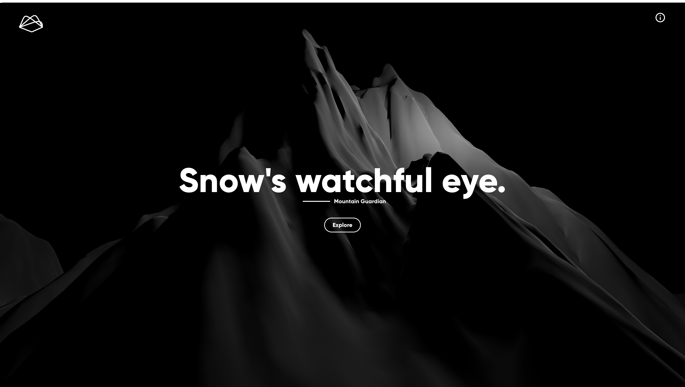

# Mountain Guardian

Mountain Guardian is a real-time Avalanche detection software equipped with report generation capabilities, polygon drawing tool and dynamic heatmaps. 

## Table of Contents

1. [Overview](#overview)
2. [Technologies Used](#technologies-used)
3. [Getting Started](#getting-started)
4. [Installation](#installation)
5. [Contributing](#contributing)
6. [License](#license)

## Overview



Mountain Guardian is a sophisticated system designed to provide real-time avalanche detection and analysis. It harnesses the power of various technologies and data sources to offer a comprehensive solution for monitoring and understanding avalanche conditions. Here's a breakdown of the main features:

1. **Real time satellite Data Acquisition**: 

2. **Geospatial Filtering**: 

3. **Polygon Drawing Tool**: 

4. **Report Generation**:

5. **Analytics Dashboard**:

## Technologies Used

- **Frontend**:
  - React
  - React Three Fiber
  - Tailwind CSS and MaterialUI
  - React-Google-Maps library
  - Leaflet

- **Backend**:
  - Flask

- **Machine Learning**:
  - TensorFlow/Keras

   The machine learning aspect of Mountain Guardian utilizes various techniques, including change detection, LSTM (Long Short-Term Memory), and ResNet models implemented using TensorFlow/Keras. These models are responsible for analyzing the satellite data and providing real-time avalanche risk predictions.

## Getting Started

To get started, see [Requirements](#requirements) and
[Installation](#installation). See
[Usage](docs/user_guide.md) for a comprehensive feature overview.

## Requirements

- Node.js (v14.17.0 or higher)
- Python (v3.7 or higher)
- Java Development Kit (JDK) 11
- TensorFlow (v2.0 or higher)

## Installation

1. Clone the project repository:

    ```bash
    $ git clone https://github.com/rawalabhinav/mountain-guardian.git
    ```

2. Navigate to the project directory:

    ```bash
    $ cd Mountain-Guardian
    ```

3. Install frontend dependencies:

    ```bash
    $ cd frontend
    $ npm install
    ```

4. Install backend dependencies:

    ```bash
    $ cd ../backend
    $ ./mvnw clean install
    ```

5. Set up the machine learning environment:

6. Configure the project:

- Create a `.env` file in the root directory and add necessary environment variables (eg. your Google Maps API Key as `REACT_APP_MAP_API_KEY = PASTE_YOUR_KEY_HERE`)
- Update the backend application properties in `application.properties`.

7. Start the frontend and backend:

    ```bash
    # Start the frontend
    $ cd ../frontend
    $ npm start

    # Start the backend
    $ cd ../backend
    $ ./mvnw spring-boot:run
    ```

## Contributing

We welcome contributions to the Mountain Guardian project. If you're interested in contributing, please read our [Contribution Guidelines](/docs/contributing.md) and follow the instructions provided.

## License

Mountain Guardian is licensed under the [MIT License](LICENSE). Feel free to use, modify, and distribute the code as per the terms of the license.
